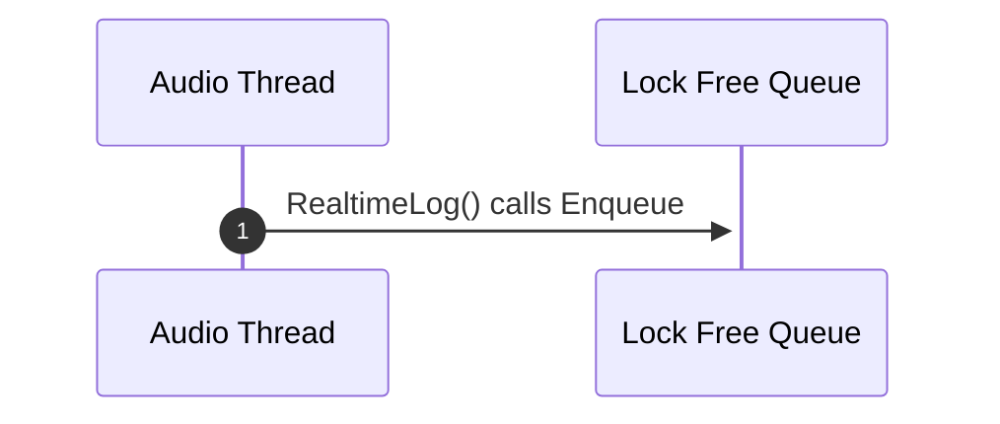
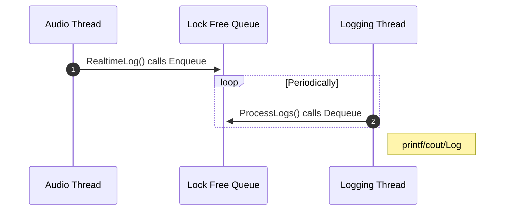
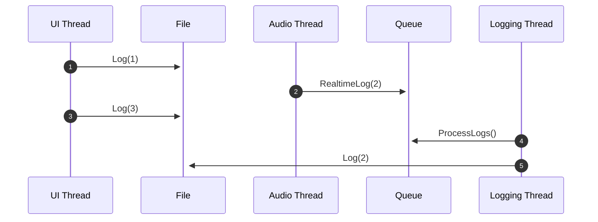

<div class='text-center font-medium text-shadow-lg'>

# Taming real-time logging 
## Lessons learned from the trenches

Chris Apple

</div>


<!--
<div class="pt-12">
  <span @click="$slidev.nav.next" class="px-2 py-1 rounded cursor-pointer" hover="bg-white bg-opacity-10">
    Press Space for next page <carbon:arrow-right class="inline"/>
  </span>
</div>

<div class="abs-br m-6 flex gap-2">
  <button @click="$slidev.nav.openInEditor()" title="Open in Editor" class="text-xl slidev-icon-btn opacity-50 !border-none !hover:text-white">
    <carbon:edit />
  </button>
  <a href="https://github.com/slidevjs/slidev" target="_blank" alt="GitHub"
    class="text-xl slidev-icon-btn opacity-50 !border-none !hover:text-white">
    <carbon-logo-github />
  </a>
</div>
-->

<!--

-->

---
layout: image-right
image: speaker_portrait.jpg
---

# About me

<br>

## Chris Apple - <carbon-logo-github/> `cjappl`

<br>

- Lead Audio Software Engineer - Spatial Inc.
- 8 years experience in the audio industry
    - Dolby
    - Roblox
- Specialist in immersive audio.
    - Playback and content creation.

<!-- TODO slide numbers?? -->
<!-- <div class="absolute left-5px bottom-5px">
<SlideCurrentNo />
</div>

<br>
<br> !-->

---
layout: cover
background: cassette.avif
---

<div class='text-center font-medium text-shadow-lg'>

# Why do we need a real-time logger?

</div>

---
---


# Motivation

## 1. Diagnostics

```cpp
LOG_CRIT("Error occurred! Send help! %s", someErrorString);
```

<br>

## 2. Metrics

```cpp
LogRenderStatistics(mAverageRenderTime, mPeakRenderTime);
```

<br>

## 3. User generated Lua code

```cpp
RenderUserLua();
```

---
layout: cover
background: cassette.avif 
---

<div class='text-center font-medium text-shadow-lg'>

# Version 0
## The problem with simple printf logging

</div>


---
---
# Version 0: The problem with simple printf logging
<br>

```cpp {all|12|1,6}
void RealtimeLog(const char* format, ...)
{
   va_list args;

   va_start(args, format);
   vprintf(format, args);
   va_end(args);
}

int RealtimeCallback()
{
   RealtimeLog("Hello %s. My Lucky number is %d", "World", 777);
}

```

---
clicks: 1 
---
# Real-time safety recap
<br>
<br>

<div v-if="$slidev.nav.clicks == 0">
<div class="grid grid-cols-3 flex justify-center gap-40">
    <div class="box-border h-40 w-40 p-4 border-4 border-black-500 rounded-md">
      <div class="text-center text-black-500">
          <AutoFitText :max="30" :min="20" modelValue="No system calls"/>
      </div>
    </div>
    <div class="box-border h-40 w-40 p-4 border-4 border-black-500 rounded-md">
      <div class="text-center text-black-500">
          <AutoFitText :max="30" :min="20" modelValue="No allocations"/>
      </div>
    </div>
    <div class="box-border h-40 w-40 p-4 border-4 border-black-500 rounded-md">
      <div class="text-center text-black-500">
          <AutoFitText :max="30" :min="20" modelValue="No mutexes"/>
      </div>
    </div>
</div>
</div>

<div v-if="$slidev.nav.clicks > 0">

<div class="grid grid-cols-3 flex justify-center gap-40">
    <div class="box-border h-40 w-40 p-4 border-4 border-rose-500 rounded-md">
      <div class="text-center text-rose-500">
          <AutoFitText :max="30" :min="20" modelValue="No system calls"/>
      </div>
    </div>
    <div class="box-border h-40 w-40 p-4 border-4 border-yellow-500 rounded-md">
      <div class="text-center text-yellow-500">
          <AutoFitText :max="30" :min="20" modelValue="No allocations"/>
      </div>
    </div>
    <div class="box-border h-40 w-40 p-4 border-4 border-yellow-500 rounded-md">
      <div class="text-center text-yellow-500">
          <AutoFitText :max="30" :min="20" modelValue="No mutexes"/>
      </div>
    </div>
</div>

<br>

```cpp
void RealtimeLog(const char* format, ...)
{
   va_list args;

   va_start(args, format);
   vprintf(format, args);
   va_end(args);
}
```

</div>

---
layout: cover
background: cassette.avif 
---

<div class='text-center font-medium text-shadow-lg'>

# Version 1
## Using a logging thread

</div>

---
clicks: 1 
---

# Version 1: Logging thread with lock free queue


<div v-if="$slidev.nav.clicks == 0">



</div>

<div v-if="$slidev.nav.clicks > 0">



</div>


---
disabled: true
---

# Version 1: Logging thread with lock free queue

```cpp{all|8|10|5|all}
struct LoggingData
{
   LogRegion region;
   LogLevel  level;
   char      message[MAX_MESSAGE_SIZE];
};

using LockFreeLoggingQueue = moodycamel::ReaderWriterQueue<LoggingData>;

LockFreeLoggingQueue mLoggingQueue { LOG_QUEUE_MAX_SIZE };
```

---
layout: image-right
image: /Moodycamel_logo.png
---

# A lock free queue

```cpp {3,4|6,7}
using namespace moodycamel;

// Reserve space for 100 elements
ReaderWriterQueue<int> q{100}; 

// Try to enqueue (never allocates)
bool succeeded = q.try_enqueue(18);  
assert(succeeded);

```
<br>
<br>
<br>
<br>
<br>
<br>
<br>
<br>

[A Fast Lock-Free Queue for C++](https://moodycamel.com/blog/2013/a-fast-lock-free-queue-for-c++)

---
---

# Version 1: Logging thread with lock free queue

```cpp
struct LoggingData 
{
   LogRegion region;
   LogLevel  level;
   char      message[MAX_MESSAGE_SIZE];
};
```
<br> 

<v-click>
```cpp {all|8|10|all}
void RealtimeLog(LogRegion region, LogLevel level, const char* format, ...) 
{
   LoggingData data;
   data.region = region;
   data.level = level;

   .. va_args_nonsense ..
   vsnprintf(data.message, MAX_MESSAGE_SIZE, format, args);

   mLoggingQueue.try_enqueue(data);
}
```
</v-click>

---
---

# Version 1: Logging thread with lock free queue

```cpp 
void RealtimeLog(LogRegion region, LogLevel level, const char* format, ...) 
{
   ...

   mLoggingQueue.try_enqueue(data);
}
```

<br> 

```cpp {all|6|all}
void LoggingThread() 
{
   while(true) {

       LoggingData data;
       while (mLoggingQueue.try_dequeue(data)) {
           std::cout << "[" << data.level << "] ";
           std::cout << "(" << data.region << ") ";
           std::cout <<        data.message;
           std::cout << '\n';
       }

   }
}
```

---

# Truncation and data loss
```cpp{all|1,8|2,13|all}
constexpr auto MAX_MESSAGE_SIZE = 512;   // WILL TRUNCATE ANOTHING MORE!
constexpr auto LOG_QUEUE_MAX_SIZE = 100; // WILL DROP ANY MESSAGES IF QUEUE IS FULL!

struct LoggingData
{
   LogRegion region;
   LogLevel  level;
   char      message[MAX_MESSAGE_SIZE];
};

using LockFreeLoggingQueue = moodycamel::ReaderWriterQueue<LoggingData>;

LockFreeLoggingQueue mLoggingQueue { LOG_QUEUE_MAX_SIZE };
```

<!--
Also, messages can get "caught in the queue" you crash or don't shut down properly! Leaving valuable data behind.

also mention speed
-->


---
---

# All done??
<br>

<div class="grid grid-cols-3 flex justify-center gap-40">
    <div class="box-border h-40 w-40 p-4 border-4 border-emerald-500 rounded-md">
      <div class="text-center text-emerald-500">
          <AutoFitText :max="30" :min="20" modelValue="No system calls"/>
      </div>
    </div>
    <div class="box-border h-40 w-40 p-4 border-4 border-emerald-500 rounded-md">
      <div class="text-center text-emerald-500">
          <AutoFitText :max="30" :min="20" modelValue="No allocations"/>
      </div>
    </div>
    <div class="box-border h-40 w-40 p-4 border-4 border-emerald-500 rounded-md">
      <div class="text-center text-emerald-500">
          <AutoFitText :max="30" :min="20" modelValue="No mutexes"/>
      </div>
    </div>
</div>

---

# What's wrong here?

```cpp{all|8}
void RealtimeLog(/* */) 
{
   LoggingData data;
   data.region = region;
   data.level = level;

   .. va_args_nonsense ..
   vsnprintf(data.message, MAX_MESSAGE_SIZE, format, args);

   mLoggingQueue.try_enqueue(data);
}
```

<br>

<div v-click="2">

```
man 3 vsnprintf
```
> ... 
> **thousands and decimal separator returned by localeconv(3)**. 
> ... 

<br>

</div>

<div v-click="3">

```
1,234.56 -> 1.234,567 -> 1 234,567
```

</div>

---
layout: image
image: /StackTrace_printf.png
---


---

# Log thread using std library snprintf functions
<br>

<div class="grid grid-cols-3 flex justify-center gap-40">
    <div class="box-border h-40 w-40 p-4 border-4 border-rose-500 rounded-md">
      <div class="text-center text-rose-500">
          <AutoFitText :max="30" :min="20" modelValue="No system calls"/>
      </div>
    </div>
    <div class="box-border h-40 w-40 p-4 border-4 border-yellow-500 rounded-md">
      <div class="text-center text-yellow-500">
          <AutoFitText :max="30" :min="20" modelValue="No allocations"/>
      </div>
    </div>
    <div class="box-border h-40 w-40 p-4 border-4 border-rose-500 rounded-md">
      <div class="text-center text-rose-500">
          <AutoFitText :max="30" :min="20" modelValue="No mutexes"/>
      </div>
    </div>
</div>

<!--
-->

---
layout: cover
background: chip.jpg 
---

<div class='text-center font-medium text-shadow-lg backdrop-blur-2 rounded-2xl'>

# A group more paranoid than audio software engineers?

</div>

---
layout: cover
background: chip.jpg 
---

<div class='text-center font-medium text-shadow-lg backdrop-blur-2 rounded-2xl'>

# Embedded systems engineers!

</div>


---
layout: image-right
image: /stb.png
---

# `stb` - single file libraries
<br>

<div v-click="1">

```cpp
// in stb_sprintf.h
// for va_arg(), va_list()
#include <stdarg.h> 

 // size_t, ptrdiff_t
#include <stddef.h>
```

</div>

---

# Version 2: Using a third party vsnprintf

```cpp{2,3,13-14}

#define STB_SPRINTF_IMPLEMENTATION
#include "stb_sprintf.h"

void RealtimeLog(/* */) 
{
   ...

   va_list args;

   va_start(args, format);

   //  vsnprintf(data.message, MAX_MESSAGE_SIZE, format, args);
   stb_vsnprintf(data.message, MAX_MESSAGE_SIZE, format, args);

   va_end(args);

   mLoggingQueue.try_enqueue(data);
}
```


---
layout: cover
background: cassette.avif 
---

# Is using va_args real-time safe?


---
clicks: 1 
---

# Yes!

<div v-if="$slidev.nav.clicks >= 0">


```c
void func (int a, ...)
{
   // va_start
   char *p = (char *) &a + sizeof a;

   // va_arg
   int i1 = *((int *)p);
   p += sizeof (int);

   // va_arg
   long i2 = *((long *)p);
   p += sizeof (long);
}
```
</div>

<div v-if="$slidev.nav.clicks >= 1">

<br>

## ...ish (?)

```console
> man 3 va_args # https://linux.die.net/man/3/va_arg
...
Finally, on systems where arguments are passed in registers, 
it may be necessary for va_start() to allocate memory
...
```

</div>

---
clicks: 1
---

# Variadic Templates as an alternative to va_args[^1]

<div v-if="$slidev.nav.clicks == 0">

```cpp
template<typename ...T>
void RealtimeLogFmt(/* */, T&&... args)
{
    ...
};

```
</div>

<div v-if="$slidev.nav.clicks >= 1">


```cpp
template<typename ...T>
void RealtimeLogFmt(/* */, fmt::format_string<T...> fmtString, T&&... args)
{
    ...
    fmt::format_to_n(data.message, MAX_MESSAGE_SIZE, fmtString, args...);

    mLoggingQueue.try_enqueue(data);
};

RealtimeLogFmt(/* */, "Hello {}. My lucky number is {}", "world", 777);
```

</div>

[^1]: [Variadic Templates are Funadic - CppCon 2012](https://www.youtube.com/watch?v=dD57tJjkumE)

<style>
.footnotes-sep {
  @apply mt-20 opacity-10;
}
.footnotes {
  @apply text-sm opacity-75;
    position: fixed;
    bottom: 0;
    width: 100%;
}
.footnote-backref {
  display: none;
}
</style>

<!--
FIXME
-->

---
---

# Version 2: Logging thread + `stb_vsnprintf`
<br>
<div class="grid grid-cols-3 flex justify-center gap-40">
    <div class="box-border h-40 w-40 p-4 border-4 border-green-500 rounded-md">
      <div class="text-center text-green-500">
          <AutoFitText :max="30" :min="20" modelValue="No system calls"/>
      </div>
    </div>
    <div class="box-border h-40 w-40 p-4 border-4 border-green-500 rounded-md">
      <div class="text-center text-green-500">
          <AutoFitText :max="30" :min="20" modelValue="No allocations"/>
      </div>
    </div>
    <div class="box-border h-40 w-40 p-4 border-4 border-green-500 rounded-md">
      <div class="text-center text-green-500">
          <AutoFitText :max="30" :min="20" modelValue="No mutexes"/>
      </div>
    </div>
</div>
<br>

```cpp
void RealtimeLog(LogRegion region, LogLevel level, const char* format, ...) {
    LoggingData data;
    data.region = region;
    data.level = level;

    va_list args;
    va_start(args, format);
    stb_vsnprintf(data.message, MAX_MESSAGE_SIZE, format, args);
    va_end()

    mLoggingQueue.try_enqueue(data);
}
```


---
layout: cover
background: cassette.avif 
---

<div class='text-center font-medium text-shadow-lg'>

# A note on ordering

</div>

---
---

# A note on ordering
```cpp
void UserInterfaceThread()
{
    Log(1);
     
    Log(3);
}
```
<br>
<br>

```cpp
void RealtimeCallback ()
{

    RealtimeLog(2);

}
```

---
clicks: 1
---


# A note on ordering

<div v-if="$slidev.nav.clicks == 0">


</div>

<div v-if="$slidev.nav.clicks >= 1">

```bash
> ./testPrinter.out
UI   : 1
UI   : 3
AUDIO: 2
```


</div>

---
layout: two-cols
disabled: true
---

# Non-real-time logging

```cpp{all|0|2}
void Log(...) {
   PrintToFile(region, level, message);
}
```

::right::

<div v-click="1">

# Real-time logging

```cpp{all|7,11}
void RealtimeLog(...) {
   ...
   mLoggingQueue.try_enqueue(data);
}

// Periodically polled
void ProcessAndPrintLogs()
{
   mLoggingQueue.try_dequeue(data)

   PrintToFile(data.region, data.level, 
               data.message);
}
```
</div>

---
---

# Version 3: An atomic "sequence number"

```cpp
#include <atomic>

static std::atomic<int> gSequenceNumber { 0 };
```

<br>

<div v-click="1">
```cpp
void Log(/* */) {
   PrintToFile(++gSequenceNumber, ...);
}
```
</div>

<br>

<div v-click="2">
```cpp
void RealtimeLog(/* */) {
   ...
   data.sequenceNumber = ++gSequenceNumber;
   mLoggingQueue.try_enqueue(data);
}
```
</div>

---

# Logging thread + `stb_vsnprintf` + seq number
<br>
<div class="grid grid-cols-3 flex justify-center gap-40">
    <div class="box-border h-40 w-40 p-4 border-4 border-green-500 rounded-md">
      <div class="text-center text-green-500">
          <AutoFitText :max="30" :min="20" modelValue="No system calls"/>
      </div>
    </div>
    <div class="box-border h-40 w-40 p-4 border-4 border-green-500 rounded-md">
      <div class="text-center text-green-500">
          <AutoFitText :max="30" :min="20" modelValue="No allocations"/>
      </div>
    </div>
    <div class="box-border h-40 w-40 p-4 border-4 border-green-500 rounded-md">
      <div class="text-center text-green-500">
          <AutoFitText :max="30" :min="20" modelValue="No mutexes"/>
      </div>
    </div>
</div>

<br>
<br>

## Relative ordering preserved!

```bash
{"region": "LOG  ", "severity": "INFO", "message": "...", "seq": 1}
{"region": "SPATL", "severity": "DEBG", "message": "...", "seq": 3}
{"region": "DEMON", "severity": "INFO", "message": "...", "seq": 4}
{"region": "DEMON", "severity": "INFO", "message": "...", "seq": 5}
{"region": "AUDIO", "severity": "INFO", "message": "...", "seq": 2}
```

---
---


# Implementation summary

<br>

## On initialization:
1. Create a lock-free queue containing type `LogData` - contains any custom type plus a `char` buffer.
2. Create a thread to periodically call `ProcessLog`.

<br>

## In the `RealtimeLog` function:
1. Create a stack variable of type `LogData`.
2. Using a real-time safe `printf` family method, print your variable arguments into the buffer.
3. Fill in `LogData`'s sequence number with the next atomic sequence number to preserve ordering.
4. Try to enqueue the data.

<br>

## In the `ProcessLog` function:
1. Periodically dequeue the messages in the `LogData` queue, and Log them!

---
---

# `cjappl/rtlog-cpp`

<br>
<div class="h-screen">


  <a href="https://github.com/cjappl/rtlog-cpp" target="_blank" alt="GitHub"
    class="text-xl slidev-icon-btn!border-none p-1/2 justify-center">
    <carbon-logo-github />
  </a>

</div>

---
layout: cover
class: "text-center"
background: cassette.avif 
disabled: true
---

# Limitations

---
disabled: true
---

# Truncation and data loss
```cpp{all|1,8|2,13|all}
constexpr auto MAX_MESSAGE_SIZE = 512;   // WILL TRUNCATE ANOTHING MORE!
constexpr auto LOG_QUEUE_MAX_SIZE = 100; // WILL DROP ANY MESSAGES IF QUEUE IS FULL!

struct LoggingData
{
   LogRegion region;
   LogLevel  level;
   char      message[MAX_MESSAGE_SIZE];
};

using LockFreeLoggingQueue = moodycamel::ReaderWriterQueue<LoggingData>;

LockFreeLoggingQueue mLoggingQueue { LOG_QUEUE_MAX_SIZE };
```

<!--
Also, messages can get "caught in the queue" you crash or don't shut down properly! Leaving valuable data behind.
-->

---
layout: image-right
image: racecar.avif
disabled: true
---

# Speed

- Lock free queues run on atomic pointers, which can be slow. 

## Advice
- Log sparingly.
- Consider compiling out in release mode.
- Don't use your real-time log for all logging!
    - Prevents data loss.
    - No performance penalty for atomics.
    - Flushes as often as you'd like.

<br>

---

# What did we learn?

<v-clicks>

- Don't use normal logging in your real-time thread.
- A real-time logger is a lock-free queue that you can print messages into.
- Beware the sneaky system calls to `localeconv` in standard `printf` family code.
- Use sequence numbers to ensure your loggers have proper ordering.
- Beware the possibility of data loss using the real-time logger.
- `va_args` is real-time safe on many platforms.
    - Variadic templates are probably the best general solution for all systems.
    - Also unlocks the use of `libfmt` - which is type-safe as well!

</v-clicks>

---
disabled: true
---

# Thank you!

<div class="text-center">

`cjappl/rtlog-cpp`

</div>

<div class="h-screen">


  <a href="https://github.com/cjappl/rtlog-cpp" target="_blank" alt="GitHub"
    class="text-xl slidev-icon-btn!border-none p-1/2 justify-center">
    <carbon-logo-github />
  </a>

</div>

---
layout: image-right
image: speaker_portrait.jpg
---

# Special thanks

## Reviewers

- Ryan Avery
- Palmer Hogen
- Eric Odland
- David O'Neal
- Matt Oshry

## Open source libraries

- [`moodycamel/readerwriterqueue`](https://github.com/cameron314/readerwriterqueue)
- [`nothings/stb`](https://github.com/nothings/stb)

## Slides created in 
- [`slidevjs/slidev`](https://github.com/slidevjs/slidev)


---
layout: cover
background: cassette.avif 
---

<div class='text-center font-medium text-shadow-lg'>

# Appendix

</div>

---
---

# Variadic templates and `libfmt`

According to the author of `libfmt` you can use `format_to_n` safely with no allocations![^1]

```cpp{all|1-2|8|15}
template<typename ...T>
void RealtimeLogFmt(LogRegion region, LogLevel level, fmt::format_string<T...> fmtString, T&&... args)
{
    NewLoggingData data;
    auto& buffer = data.message;

    ...
    fmt::format_to_n(buffer, MAX_MESSAGE_SIZE, fmtString, args...);

    mLoggingQueue.try_enqueue(data);
};

int main() 
{
    RealtimeLogFmt(LogRegion::Network, LogLevel::Info, FMT_STRING("{} - {:.2f} - {}"), 42, 3.14, "hello");
    ProcessAndPrintLogs();
    return 0;
}
```


[^1]: [Possible memory allocations #1665 fmtlib/fmt](https://github.com/fmtlib/fmt/issues/1665)

<style>
.footnotes-sep {
  @apply mt-20 opacity-10;
}
.footnotes {
  @apply text-sm opacity-75;
    position: fixed;
    bottom: 0;
    width: 100%;
}
.footnote-backref {
  display: none;
}
</style>


---
layout: cover
class: 'text-center'
background: caution.avif
---

<div class='text-center font-medium text-shadow-lg'>

# CAUTION: 
## C++20 libfmt not guaranteed to be real-time safe!

</div>


---
---

# `rtlog-cpp`

```cpp
struct LogData
{
    LogLevel level;
    LogRegion region;
};

static auto PrintMessage = [](const LogData& data, size_t sequenceNumber, const char* fstring, ...) 
                           __attribute__ ((format (printf, 4, 5)))
{
...
};

rtlog::Logger<LogData, MAX_NUM_LOG_MESSAGES, MAX_LOG_MESSAGE_LENGTH, gSequenceNumber> gRealtimeLogger;
rtlog::LogProcessingThread thread{gRealtimeLogger, PrintMessage, std::chrono::milliseconds(10)};

void SomeFunction()
{
    gRealtimeLogger.Log({LogLevel::Debug, LogRegion::Engine}, "Hello, %lu!", 123l); 
}

```

---
---
# `rtlog-cpp`

```cpp
Status Log(const LogData& inputData, const char* format, ...) __attribute__ ((format (printf, 3, 4))) {
    auto retVal = Status::Success;

    InternalLogData dataToQueue;
    dataToQueue.mLogData = inputData;
    dataToQueue.mSequenceNumber = ++SequenceNumber;

    va_list args;
    va_start(args, format);
    auto result = stbsp_vsnprintf(dataToQueue.mMessage.data(), dataToQueue.mMessage.size(), format, args);
    va_end(args);

    if (result < 0 || result >= dataToQueue.mMessage.size())
        retVal = Status::Error_MessageTruncated;

    // Even if the message was truncated, we still try to enqueue it to minimize data loss
    const bool dataWasEnqueued = mQueue.try_enqueue(dataToQueue);

    if (!dataWasEnqueued)
        retVal = Status::Error_QueueFull;

    return retVal;
}
```
