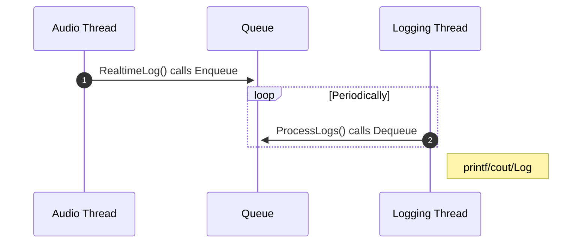
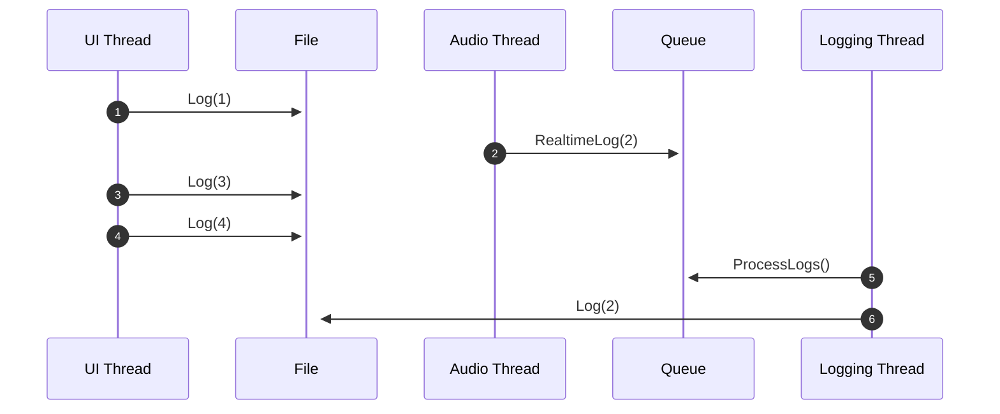
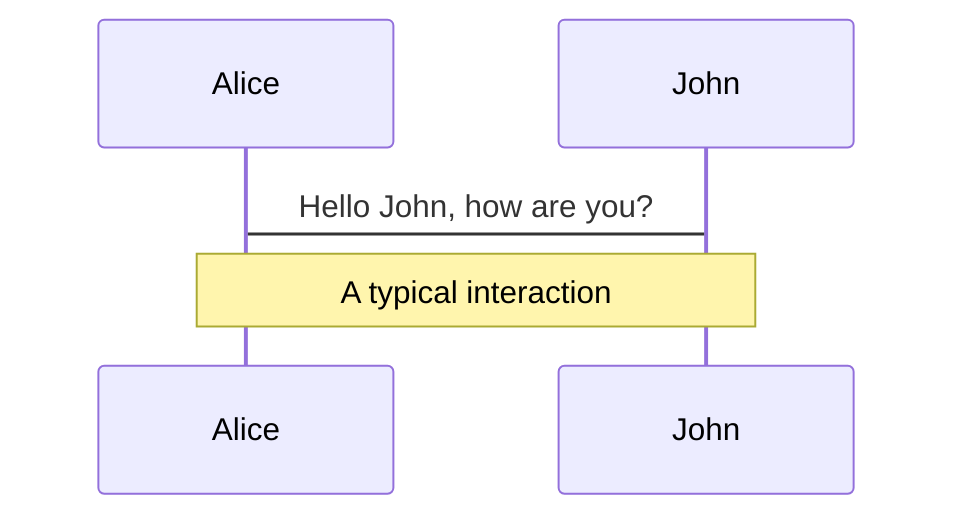
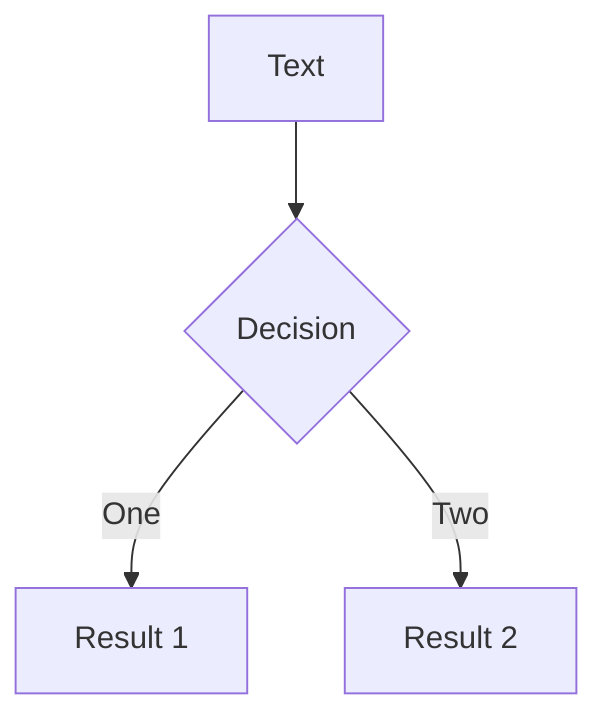
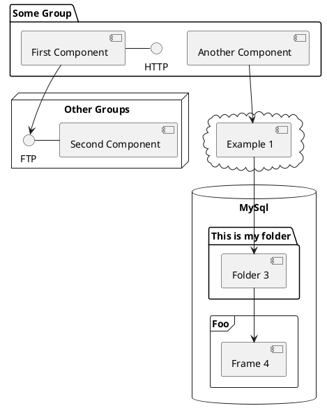

---
# try also 'default' to start simple
theme: default
# random image from a curated Unsplash collection by Anthony
# like them? see https://unsplash.com/collections/94734566/slidev
background: https://source.unsplash.com/collection/94734566/1920x1080
# apply any windi css classes to the current slide
class: 'text-center'
# https://sli.dev/custom/highlighters.html
highlighter: shiki
# show line numbers in code blocks
lineNumbers: true
# some information about the slides, markdown enabled

# persist drawings in exports and build
drawings:
  persist: false
# page transition
transition: slide-left
# use UnoCSS
css: unocss
# light or dark?
colorSchema: 'light'
# favicon
favicon: 'https://cdn.jsdelivr.net/gh/slidevjs/slidev/assets/favicon.png'
---


# Taming real-time logging 
## Lessons learned from the trenches

Christopher Apple

<!--
<div class="pt-12">
  <span @click="$slidev.nav.next" class="px-2 py-1 rounded cursor-pointer" hover="bg-white bg-opacity-10">
    Press Space for next page <carbon:arrow-right class="inline"/>
  </span>
</div>

<div class="abs-br m-6 flex gap-2">
  <button @click="$slidev.nav.openInEditor()" title="Open in Editor" class="text-xl slidev-icon-btn opacity-50 !border-none !hover:text-white">
    <carbon:edit />
  </button>
  <a href="https://github.com/slidevjs/slidev" target="_blank" alt="GitHub"
    class="text-xl slidev-icon-btn opacity-50 !border-none !hover:text-white">
    <carbon-logo-github />
  </a>
</div>
-->

<!--
The last comment block of each slide will be treated as slide notes. It will be visible and editable in Presenter Mode along with the slide. [Read more in the docs](https://sli.dev/guide/syntax.html#notes)
-->

---
layout: image-right
image: https://source.unsplash.com/collection/94734566/1920x1080
---

# About me

<br>

## Christopher Apple

<br>

- Lead Audio Software Engineer @ Spatial Inc
- 8 years experience in the audio industry
    - Dolby
    - Roblox
- Specialize in immersive audio.
- Love music, DJing and technology! 

<br>
<br>

Github [https://github.com/cjappl](https://github.com/cjappl)

<!--
You can have `style` tag in markdown to override the style for the current page.
Learn more: https://sli.dev/guide/syntax#embedded-styles

<style>
h1 {
  background-color: #2B90B6;
  background-image: linear-gradient(45deg, #4EC5D4 10%, #146b8c 20%);
  background-size: 100%;
  -webkit-background-clip: text;
  -moz-background-clip: text;
  -webkit-text-fill-color: transparent;
  -moz-text-fill-color: transparent;
}
</style>
-->

<!--
Here is another comment.
-->

---
---

# Goals

- Design a real-time safe logger
    - Lock free
    - Allocation free
    - System call free
- Logger must support general purpose use
    - Any number of arguments, like `cout`, `printf`, `fmt`
    - `RealtimeLog("Hello, %s, lucky number: %d", "World", 777);`
- Third Party Libraries have reasonable licensing for corporate use.

---
---

# Motivation: Diagnostics 
<br>
```cpp
void SomeRealtimeFunction(float** buffer, int bufferSize, int channels)
{
   ...
   if (retVal != STATUS_OK)
   {
       LOG_CRIT("Error occurred! Send help! %s", someErrorString);
   }
}
```

---
---

# Motivation: Observability and Metrics
<br>
```cpp {all|8-12}
void SomeRealtimeFunction() 
{
  const auto startTime = GetTimestamp();
  RenderAudio()
  const auto endTime = GetTimestamp();

  mAverageRenderTime = ...; mPeakRenderTime = ...;

  if (haventLoggedIn10Seconds) 
  {
     LogRenderStatistics(mAverageRenderTime, mPeakRenderTime);
  }
}
```

---
layout: image-right
image: https://source.unsplash.com/collection/94734566/1920x1080
---

# Motivation: User generated logging 
<br>

- Evaluating user generated Lua code.
- Users leaving logging in the `OnRender` callback.
<!-- Directive usage: this will be invisible until you press "next" the second time -->
<br>
<div v-click class="text-xl p-2">

"Logs you can hear"

</div>

---
---
# Version 0: The problem with simple printf logging
<br>

```cpp {all|6}
void RealtimeLog(const char* format, ...)
{
   va_list args;

   va_start(args, format);
   vprintf(format, args);
   va_end(args);
}

int RealtimeCallback()
{
   RealtimeLog("Hello %s. My Lucky number is %d", "World", 777);
}

```

---
---

# Version 1: Using a lock-free queue

<br>



---
---

# Version 1: Using a lock-free queue
<br>

```cpp{all|5|10|8|all}
struct LoggingData
{
   LogRegion region;
   LogLevel  level;
   char      message[MAX_MESSAGE_SIZE];
};

using LockFreeLoggingQueue = moodycamel::ReaderWriterQueue<LoggingData>;

LockFreeLoggingQueue mLoggingQueue { LOG_QUEUE_MAX_SIZE };
```

---
layout: image-right
image: /Moodycamel_logo.png
---

# ReaderWriterQueue
<br>

```cpp
using namespace moodycamel;

// Reserve space for 100 elements
ReaderWriterQueue<int> q{100}; 

// Try to enqueue (never allocates)
bool succeeded = q.try_enqueue(18);  
assert(succeeded);

int number;
q.try_dequeue(number);
```
<br>

[A Fast Lock-Free Queue for C++](https://moodycamel.com/blog/2013/a-fast-lock-free-queue-for-c++)

---
---

# Version 1: Using a lock-free queue

```cpp
struct LoggingData 
{
   LogRegion region;
   LogLevel  level;
   char      message[MAX_MESSAGE_SIZE];
};
```
<v-click>
```cpp {all|10|all}
void RealtimeLog(LogRegion region, LogLevel level, const char* format, ...) 
{
   LoggingData data;
   data.region = region;
   data.level = level;

   .. va_args_nonsense ..
   vsnprintf(data.message, MAX_MESSAGE_SIZE, format, args);

   mLoggingQueue.try_enqueue(data);
}
```
</v-click>

---
---

# Version 1: Using a lock-free queue

```cpp 
void RealtimeLog(LogRegion region, LogLevel level, const char* format, ...) 
{
   ...

   mLoggingQueue.try_enqueue(data);
}
```

```cpp {all|5|all}
void ProcessAndPrintLogs() 
{
   LoggingData data;

   while (mLoggingQueue.try_dequeue(data))
   {
       std::cout << "[" << data.level << "] ";
       std::cout << "(" << data.region << ") ";
       std::cout <<        data.message;
       std::cout << '\n';
   }
}
```

---
layout: fact
---

# All done??

---
---

# What's wrong here?

```cpp{all|8}
void RealtimeLog(/* */) 
{
   LoggingData data;
   data.region = region;
   data.level = level;

   .. va_args_nonsense ..
   vsnprintf(data.message, MAX_MESSAGE_SIZE, format, args);

   mLoggingQueue.try_enqueue(data);
}
```

<br>

<div v-click="2">

```
man 3 vsnprintf
```
<br>

> ... 
> (apostrophe) Decimal conversions (d, u, or i) or the integral portion of a floating point conversion (f or F) should be grouped and separated by thousands using the non-monetary separator returned by localeconv(3). 
> ... 


</div>

---
layout: image
image: /StackTrace_printf.png
---

---
layout: image-right
image: /stb.png
---

# `stb` - single file libraries
<br>

<div v-click="1">

Uses only two external headers!


```cpp {all|all|1-2|4-5}
// for va_arg(), va_list()
#include <stdarg.h> 

 // size_t, ptrdiff_t
#include <stddef.h>
```

</div>

---
---
# Version 2: Using a third party vsnprintf

<br> 
```cpp

#define STB_SPRINTF_IMPLEMENTATION
#include "stb_sprintf.h"

void RealtimeLog(/* */) 
{
   ...

   stb_vsnprintf(data.message, MAX_MESSAGE_SIZE, format, args);

   mLoggingQueue.try_enqueue(data);
}
```

---
layout: center
---

# A note on ordering

---
---

# A note on ordering
```cpp
void DatabaseFunction()
{
    Log(1);
     
    Log(3);
    Log(4);
}
```
<br>
<br>

```cpp
void RealtimeCallback ()
{

    RealtimeLog(2);

}
```


---
---


# A note on ordering



---
layout: two-cols
---

# Non-real-time logging

```cpp{all|0|all}
void Log(...) {
   PrintToFile(region, level, message);
}

void PrintToFile(...) {
   printf("[%s] (%s) ", level, region);
   printf(format, args);
   printf("\n", level, region);
}
```

::right::

<div v-click="1">

# Real-time logging

```cpp
void RealtimeLog(...) {
   ...
   mLoggingQueue.try_enqueue(data);
}

// Periodically polled
void ProcessAndPrintLogs()
{
   PrintToFile(data.region, data.level, 
               data.message);
}
```
</div>

---
---

# Version 3: An atomic "sequence number"

```cpp
#include <atomic>

static std::atomic<int> gSequenceNumber { 0 };
```

<div v-click="1">
```cpp
void PrintToFile(int sequenceNum, /* */) {
   std::printf("%i”, sequenceNum); 
   ... // print rest
}

```
</div>
<div v-click="2">
```cpp
void Log(/* */) {
   PrintToFile(region, level, ++gSequenceNumber, message);
}
```
</div>

<div v-click="3">
```cpp
void RealtimeLog(/* */) {
   ...
   data.sequenceNumber = ++gSequenceNumber;
   mLoggingQueue.try_enqueue(data);
}
```
</div>

---
layout: cover
background: https://source.unsplash.com/collection/94734566/1920x1080
---

# Summary 

---
---

# Summary

<br>

## On initialization:
1. Create a lock-free queue containing type `LogData` - contains any custom type plus a `char` buffer.
2. Create a thread to periodically poll and print out the enqueued messages.

<br>

## In the `RealtimeLog` function:
1. Create a stack variable of type `LogData`.
2. Using a real-time safe `printf` family method, print your variable arguments into the buffer.
3. Fill in `LogData`'s sequence number with the next atomic sequence number to preserve ordering.
4. Try to enqueue the data.

<br>

## In the `ProcessLog` function:
1. periodically try to dequeue all the messages in the `LogData` queue, and Log them!


---
---
# `cjappl/rtlog-cpp`

<br>
<div class="h-screen">


  <a href="https://github.com/cjappl/rtlog-cpp" target="_blank" alt="GitHub"
    class="text-xl slidev-icon-btn!border-none p-1/2 justify-center">
    <carbon-logo-github />
  </a>

</div>

---
layout: cover
background: https://source.unsplash.com/collection/94734566/1920x1080
---

# Limitations

---
---
# Truncation and data loss
```cpp{all|1,8|2,13|all}
constexpr auto MAX_MESSAGE_SIZE = 512;
constexpr auto LOG_QUEUE_MAX_SIZE = 100;

struct LoggingData
{
   LogRegion region;
   LogLevel  level;
   char      message[MAX_MESSAGE_SIZE];
};

using LockFreeLoggingQueue = moodycamel::ReaderWriterQueue<LoggingData>;

LockFreeLoggingQueue mLoggingQueue { LOG_QUEUE_MAX_SIZE };
```

---
layout: cover
background: https://source.unsplash.com/collection/94734566/1920x1080
---

# Is using va_args real-time safe?


---
---

# Yes!

```
Higher memory address    Last parameter
                         Penultimate parameter
                         ....
                         Second parameter
Lower memory address     First parameter
```

<br>

<div v-click="1">

```c
void func (int a, ...)
{
   // va_start
   char *p = (char *) &a + sizeof a;

   // va_arg
   int i1 = *((int *)p);
   p += sizeof (int);

   // va_arg
   long i2 = *((long *)p);
   p += sizeof (long);
}
```
</div>

---
---

# Yes...ish (?)

```console
> man 3 va_args # https://linux.die.net/man/3/va_arg
...
Finally, on systems where arguments are passed in registers, 
it may be necessary for va_start() to allocate memory
...
```

---
---

# Variadic Templates as an alternative to va_args[^1]
<br>

```
template<typename ...T>
void RealtimeLog(LogRegion region, LogLevel level, T&&... args) 
{
    ...
};

```

<br>

Resolves at compile time, so guaranteed to have no allocations!

[^1]: [Variadic Templates are Funadic - CppCon 2012](https://www.youtube.com/watch?v=dD57tJjkumE)

<style>
.footnotes-sep {
  @apply mt-20 opacity-10;
}
.footnotes {
  @apply text-sm opacity-75;
    position: fixed;
    bottom: 0;
    width: 100%;
}
.footnote-backref {
  display: none;
}
</style>

---
---

# What about libfmt?

According to the author of `libfmt` you can use `format_to_n` safely with no allocations![^1]

```cpp{all|1-2|8|15}
template<typename ...T>
void RealtimeLogFmt(LogRegion region, LogLevel level, fmt::format_string<T...> fmtString, T&&... args)
{
    NewLoggingData data;
    auto& buffer = data.message;

    ...
    fmt::format_to_n(buffer, MAX_MESSAGE_SIZE, fmtString, args...);

    mLoggingQueue.try_enqueue(data);
};

int main() 
{
    RealtimeLogFmt(LogRegion::Network, LogLevel::Info, FMT_STRING("{} - {:.2f} - {}"), 42, 3.14, "hello");
    ProcessAndPrintLogs();
    return 0;
}
```


[^1]: [Possible memory allocations #1665 fmtlib/fmt](https://github.com/fmtlib/fmt/issues/1665)

<style>
.footnotes-sep {
  @apply mt-20 opacity-10;
}
.footnotes {
  @apply text-sm opacity-75;
    position: fixed;
    bottom: 0;
    width: 100%;
}
.footnote-backref {
  display: none;
}
</style>


---
layout: center
---

# WARNING: 
# C++20 `libfmt` not guaranteed to be real-time safe!

---
---

# Recap

<v-clicks>

- Don't use normal logging in your real-time thread.
- A real-time logger is a lock-free queue that you can print messages into.
- Beware the sneaky system calls to `localeconv` in standard `printf` family code.
- Use sequence numbers to ensure your loggers have proper ordering.
- `va_args` is real-time safe on most platforms
    - Variadic templates for the paranoid (or embedded inclined)

</v-clicks>

---
layout: cover
background: https://source.unsplash.com/collection/94734566/1920x1080
---

# Thank you!

---
layout: cover
background: https://source.unsplash.com/collection/94734566/1920x1080
---

# Appendix

# `rtlog-cpp`

```cpp
struct LogData
{
    LogLevel level;
    LogRegion region;
};

static auto PrintMessage = [](const LogData& data, size_t sequenceNumber, const char* fstring, ...) 
                           __attribute__ ((format (printf, 4, 5)))
{
...
};

rtlog::Logger<LogData, MAX_NUM_LOG_MESSAGES, MAX_LOG_MESSAGE_LENGTH, gSequenceNumber> gRealtimeLogger;
rtlog::LogProcessingThread thread{gRealtimeLogger, PrintMessage, std::chrono::milliseconds(10)};

void SomeFunction()
{
    gRealtimeLogger.Log({LogLevel::Debug, LogRegion::Engine}, "Hello, %lu!", 123l); 
}

```

---
---
# `rtlog-cpp`

```cpp
Status Log(const LogData& inputData, const char* format, ...) __attribute__ ((format (printf, 3, 4))) {
    auto retVal = Status::Success;

    InternalLogData dataToQueue;
    dataToQueue.mLogData = inputData;
    dataToQueue.mSequenceNumber = ++SequenceNumber;

    va_list args;
    va_start(args, format);
    auto result = stbsp_vsnprintf(dataToQueue.mMessage.data(), dataToQueue.mMessage.size(), format, args);
    va_end(args);

    if (result < 0 || result >= dataToQueue.mMessage.size())
        retVal = Status::Error_MessageTruncated;

    // Even if the message was truncated, we still try to enqueue it to minimize data loss
    const bool dataWasEnqueued = mQueue.try_enqueue(dataToQueue);

    if (!dataWasEnqueued)
        retVal = Status::Error_QueueFull;

    return retVal;
}
```


<!--
Use code snippets and get the highlighting directly![^1]

```ts {all|2|1-6|9|all}
interface User {
  id: number
  firstName: string
  lastName: string
  role: string
}

function updateUser(id: number, update: User) {
  const user = getUser(id)
  const newUser = { ...user, ...update }
  saveUser(id, newUser)
}
```

<arrow v-click="3" x1="400" y1="420" x2="230" y2="330" color="#564" width="3" arrowSize="1" />

[^1]: [Learn More](https://sli.dev/guide/syntax.html#line-highlighting)

<style>
.footnotes-sep {
  @apply mt-20 opacity-10;
}
.footnotes {
  @apply text-sm opacity-75;
}
.footnote-backref {
  display: none;
}
</style>

-->


---

# Components

<div grid="~ cols-2 gap-4">
<div>

You can use Vue components directly inside your slides.

We have provided a few built-in components like `<Tweet/>` and `<Youtube/>` that you can use directly. And adding your custom components is also super easy.

```html
<Counter :count="10" />
```

<!-- ./components/Counter.vue -->
<Counter :count="10" m="t-4" />

Check out [the guides](https://sli.dev/builtin/components.html) for more.

</div>
<div>

```html
<Tweet id="1390115482657726468" />
```

<Tweet id="1390115482657726468" scale="0.65" />

</div>
</div>

<!--
Presenter note with **bold**, *italic*, and ~~striked~~ text.

Also, HTML elements are valid:
<div class="flex w-full">
  <span style="flex-grow: 1;">Left content</span>
  <span>Right content</span>
</div>
-->


---
class: px-20
---

# Themes

Slidev comes with powerful theming support. Themes can provide styles, layouts, components, or even configurations for tools. Switching between themes by just **one edit** in your frontmatter:

<div grid="~ cols-2 gap-2" m="-t-2">

```yaml
---
theme: default
---
```

```yaml
---
theme: seriph
---
```


</div>

Read more about [How to use a theme](https://sli.dev/themes/use.html) and
check out the [Awesome Themes Gallery](https://sli.dev/themes/gallery.html).

---
preload: false
---

# Animations

Animations are powered by [@vueuse/motion](https://motion.vueuse.org/).

```html
<div
  v-motion
  :initial="{ x: -80 }"
  :enter="{ x: 0 }">
  Slidev
</div>
```

<div class="w-60 relative mt-6">
  <div class="relative w-40 h-40">
    
    
    
  </div>

  <div
    class="text-5xl absolute top-14 left-40 text-[#2B90B6] -z-1"
    v-motion
    :initial="{ x: -80, opacity: 0}"
    :enter="{ x: 0, opacity: 1, transition: { delay: 2000, duration: 1000 } }">
    Slidev
  </div>
</div>

<!-- vue script setup scripts can be directly used in markdown, and will only affects current page -->
<script setup lang="ts">
const final = {
  x: 0,
  y: 0,
  rotate: 0,
  scale: 1,
  transition: {
    type: 'spring',
    damping: 10,
    stiffness: 20,
    mass: 2
  }
}
</script>

<div
  v-motion
  :initial="{ x:35, y: 40, opacity: 0}"
  :enter="{ y: 0, opacity: 1, transition: { delay: 3500 } }">

[Learn More](https://sli.dev/guide/animations.html#motion)

</div>

---

# LaTeX

LaTeX is supported out-of-box powered by [KaTeX](https://katex.org/).

<br>

Inline $\sqrt{3x-1}+(1+x)^2$

Block
$$
\begin{array}{c}

\nabla \times \vec{\mathbf{B}} -\, \frac1c\, \frac{\partial\vec{\mathbf{E}}}{\partial t} &
= \frac{4\pi}{c}\vec{\mathbf{j}}    \nabla \cdot \vec{\mathbf{E}} & = 4 \pi \rho \\

\nabla \times \vec{\mathbf{E}}\, +\, \frac1c\, \frac{\partial\vec{\mathbf{B}}}{\partial t} & = \vec{\mathbf{0}} \\

\nabla \cdot \vec{\mathbf{B}} & = 0

\end{array}
$$

<br>

[Learn more](https://sli.dev/guide/syntax#latex)

---

# Diagrams

You can create diagrams / graphs from textual descriptions, directly in your Markdown.

<div class="grid grid-cols-3 gap-10 pt-4 -mb-6">







</div>

[Learn More](https://sli.dev/guide/syntax.html#diagrams)

---
src: ./pages/multiple-entries.md
hide: false
---

---
layout: center
class: text-center
---

# Learn More

[Documentations](https://sli.dev) · [GitHub](https://github.com/slidevjs/slidev) · [Showcases](https://sli.dev/showcases.html)
